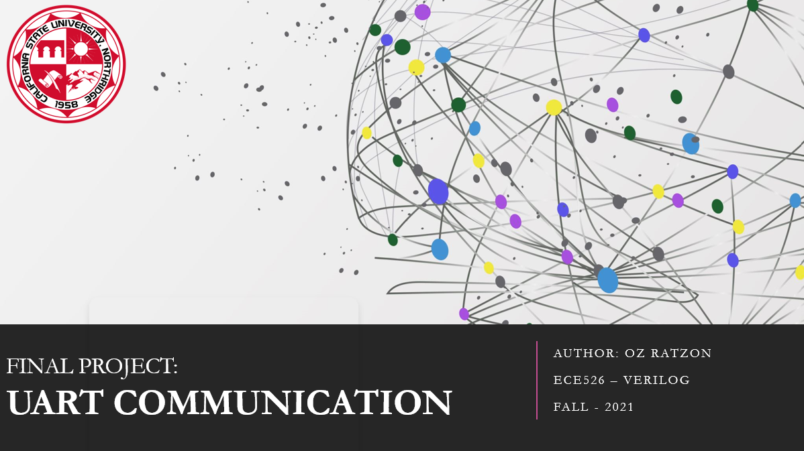
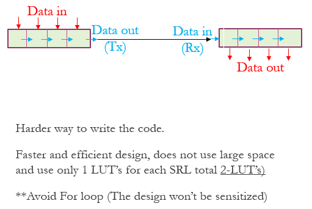
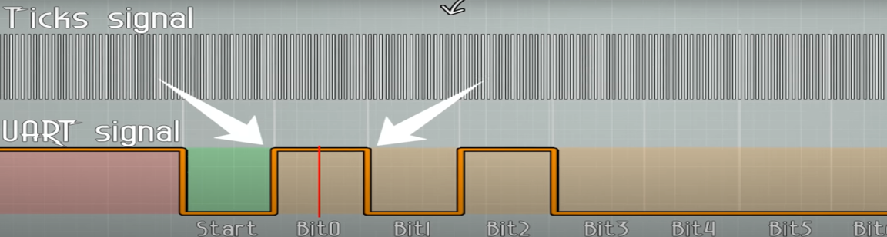
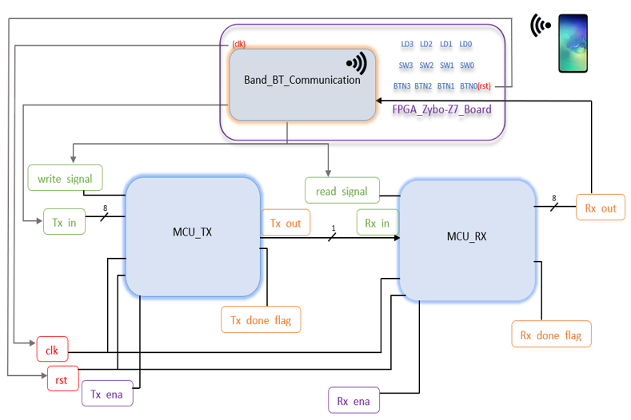
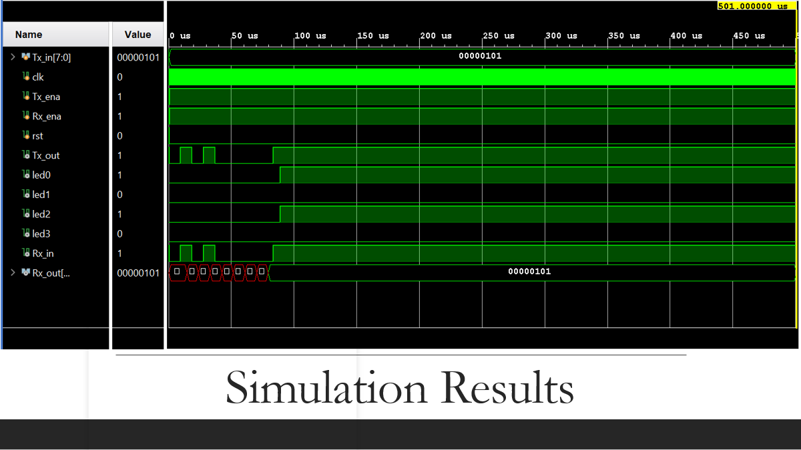
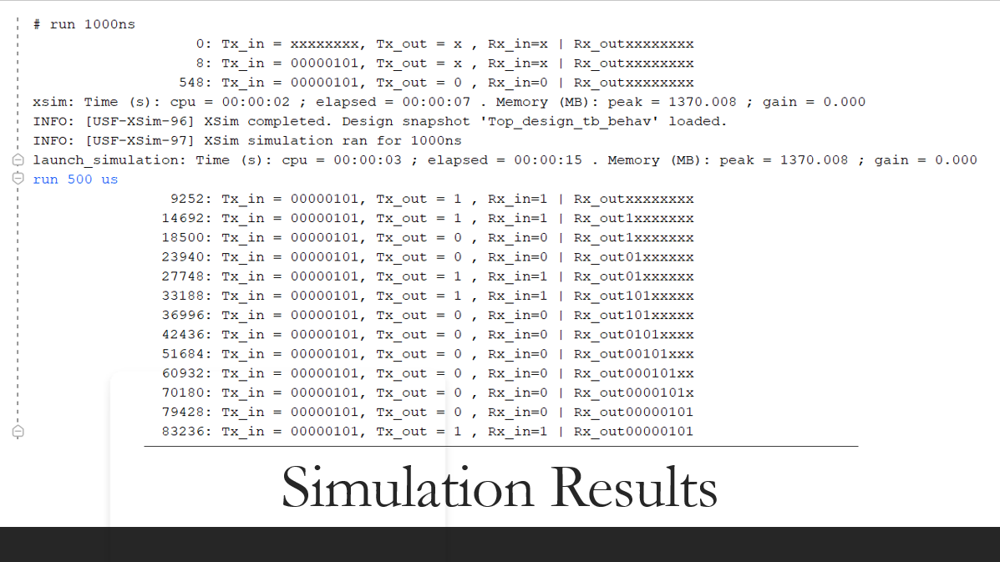

CSUN ECE Fall 2021
## Lab - UART

**Report Created by:**
- Oz Ratzon

**Submission date:** 12/09/2021

##Introduction
Universal asynchronous Receiver/Transmitter
The main idea is to transmit and receive information using serial data (bit by bit) to parallel data and vise versa.
The UART’s can communicates between each other, the process of UART’s communication which uses two UART’s to communicate directly with each other will be demonstrate in this project. 

The UART comunication process done as follow: 
Parallel input => Serial input/output => Parallel output. 

UART requires start-bit and end-bit for operation.
The start bit will be set to high and will be triggered when it will be set to low. 
The stop bit will be set to low and will be triggered when it will be set to high. 
Input data array:  {1’b0, Array[size:0], parity-bit, 1’b1}
Parity bit (optional): check for errors.  
Check if the data change during the process due to electromagnetic radiation, long distance transmit or mixture of baud rates. 

##Procedure 
we created a code for the MCU_Tx to convert parallel input to serial output and MCU_Rx to convert serial input to parallel output as show below: 

Also, we created flags in the code to identify when the data Receiver/Transmitter process is done.  

In additional we implement the code using a shift register as follow: 




**Part 1:**  
MCU_TX.vhd CODE:  
```vhdl
`timescale 1ns / 1ps

module MCU_TX(clk,rst,Tx_ena,Tx_in,write_signal,Tx_done_flag,Tx_out
    );
    
    integer current_bit = 0;
    integer i = 0;
    
    parameter num_bits = 8;
    parameter idle=1'b0 , write=1'b1;
  
    input [(num_bits-1):0] Tx_in;
    input clk, rst, Tx_ena;          //tx recive 8 bit and transmit 1 bit at the time
    input write_signal;
    
    output reg Tx_done_flag = 0;
    output reg Tx_out;
    
    reg current_state, next_state;
    reg ena_write;
    reg start_flag = 1'b1;
    reg [(num_bits+1):0]output_data;
  
    
    
    always @ (posedge clk or posedge rst)    //reset or next state condition
           begin 
              if (rst==1'b1)
                           current_state  <= idle;
                 else 
                           current_state  <= next_state;
           end
        
    always @ (Tx_in or current_state or Tx_done_flag or Tx_ena)   //where to go for each state
       begin
          case (current_state)
                idle: if (Tx_ena)          next_state = write;
                      else                 next_state = idle;
                write: if (!Tx_done_flag)     next_state = write;
                      else                 next_state = idle;
                default                    next_state = idle;
          endcase
       end  
        
      always @ (current_state or Tx_done_flag)       //what to do in each state
       begin
          case (current_state)
                idle: ena_write     <= 1'b0;     // 10bit x 16    //tx [0][00000011][1]    
                write: ena_write    <= 1'b1;
                default ena_write   <= 1'b0;                 
          endcase
       end
      
    always @ (posedge write_signal)
        begin 
          //output_data<={1'b0,Tx_in,1'b1};
            if (ena_write == 1'b1)   
              begin
                 Tx_done_flag      <= 1'b0;
                 i              <=i+1;
                     
                     if ((Tx_done_flag==1'b0) & (start_flag==1'b1)) 
                      begin
                       output_data         <={1'b1,Tx_in[7:0],1'b0};   
                       //Tx_out              <=1'b0;
                       start_flag          <=1'b0;
                      end
                       
                     else if ((i==16) & (start_flag==1'b0) & (current_bit<(num_bits+1)))    //start flag for initial 
                      begin
                       i                   <=0;
                       current_bit         <=current_bit+1;  
                      // Tx_out                         <=output_data[0];
                       output_data         <={1'b0,output_data[9:1]};                     
                            // start bit is always low and end bit is always high
                      end
                   
                     else if ((i==16) & (current_bit==(num_bits+1)))
                      begin 
                        i                  <=0;
                        current_bit        <=0;
                        //Tx_out             <=1'b1;
                        Tx_done_flag          <=1'b1; 
                      end
              end
          end
          
     always @ (posedge(clk))
          begin 
            Tx_out                         <=output_data[0];
          end 
          
endmodule
```

**Part 2:**  
MCU_RX.vhd CODE:  
```vhdl
`timescale 1ns / 1ps

module MCU_RX(clk,rst,Rx_ena,Rx_in,read_signal,Rx_done_flag,Rx_out
    );
    
    integer current_bit = 0;
    integer i = 0;
    parameter num_bits = 8;
    parameter idle=1'b0 , read=1'b1;
  
    input Rx_in;              //uart reciveved serial input
    input clk, rst, Rx_ena;
    input read_signal;
    
    output reg Rx_done_flag = 0;
    output reg [(num_bits-1):0] Rx_out;
    
    reg current_state, next_state;
    reg ena_read;
    reg start_flag = 1'b1;
    reg [(num_bits-1):0]output_data;
  
    
    
    always @ (posedge clk or posedge rst)    //reset or next state condition
           begin 
              if (rst==1'b1)
                           current_state <= idle;
                 else 
                           current_state <= next_state;
           end
        
    always @ (Rx_in or current_state or Rx_done_flag or Rx_ena)   //where to go for each state
       begin
          case (current_state)
                idle: if (!Rx_in & Rx_ena)   next_state <= read;
                      else                   next_state <= idle;
                read: if (!Rx_done_flag)     next_state <= read;
                      else                   next_state <= idle;
                default                      next_state <= idle;
          endcase
       end  
        
      always @ (current_state or Rx_done_flag)       //what to do in each state
       begin
          case (current_state)
                idle: ena_read <= 1'b0;
                read: ena_read <= 1'b1;
                default ena_read <= 1'b0;                 
          endcase
       end
      
    always @ (posedge read_signal)
        begin 
            if (ena_read == 1'b1) 
              begin
                 Rx_done_flag <= 1'b0;
                 i<=i+1;
            
                    if (start_flag & i==16/2)
                     begin 
                      i<=0;
                      start_flag<=1'b0;
                     end
           
                     else if ((i==16) & (start_flag==1'b0) & (current_bit<num_bits))
                      begin 
                       current_bit<=current_bit+1;
                       i<=0;
                       output_data<={Rx_in,output_data[7:1]};      // start bit is always low and end bit is always high
                      end
                   
                     else if ((i==16) & (Rx_in==1'b1) & (current_bit==num_bits))
                      begin 
                        current_bit<=0;
                        i<=0;
                        start_flag<=1'b0;
                        Rx_done_flag<= 1'b1;
                      end
              end
          end
          
     always @ (posedge(clk))
          begin 
            Rx_out <= output_data;
          end 
          
endmodule

```

##Baudrate design

Different module has different signal of operation. (Any speed up to 115200 baud usually 9600) The incoming and outcome bits at a specific frequency known as the baud rate.                        
Baud rate is a measure of the speed of data transfer and expressed in bits per second (bps). 
Also, we divide the period to and even number so we can locate the mid-point of the UART signal for each bit. This allow us to avoid errors and distortion while reading and writing in the UART’s.  



the FPGA operation frequency of 125MHz which gives us a period of  => 1/125MHz = 8ns
The baudrate gives us 1/115.2kbp = 8.6805us => 8680.55 ns
Therefore (8680.55ns/16(parts))/8ns = 67.8 = 68 (baudrate_counter) (Can be divide by any even number) 


**Part 3:**  
Tick_signal.vhd CODE:  
```vhdl
`timescale 1ns / 1ps

module Tick_signal(
    input clk,
    input [15:0] baudrate,
    input rst,
    output tick_out
    );
    reg [15:0] baudrate_reg = 0;
    
    always @(posedge (clk))
         begin 
           if (tick_out) baudrate_reg <= 16'b1;
             else baudrate_reg <= baudrate_reg + 1'b1;
             end
          
           assign tick_out = (baudrate_reg == baudrate) ? 1'b1:1'b0;    
endmodule

```

##Top design 

The top design map all input and output of the modules in the design to each other to create the connection between them as show below:




**Part 4:**  
Top_design.vhd CODE:  
```vhdl
`timescale 1ns / 1ps

//1/115.2kbp = 8.6805us => 8680.55 ns
//1/125MHz = 8ns
//(8680.55ns/16(parts))/8ns = 67.8 = 68

`define baud_rate 16'd68

module Top_design(
    input clk,Tx_ena,Rx_ena,rst,
    input [7:0] Tx_in, 
    output Tx_out,led0,led1,led2,led3,
    output Rx_in,
    output [7:0] Rx_out  
    );

  reg counter;
  wire read_signal;
  wire Rx_done_flag;
  wire Tx_done_flag;
  wire write_signal;
  //wire Rx_in;
  
  assign Rx_in = Tx_out; // map Tx_out to Rx_in 
  assign write_signal = read_signal; 
  // assign tick signal to read and write signal 
  // while controling the read and write process 
  // using TX_ena and Rx_ena (enable) 
 
//1st stage 
MCU_TX UUT_Tx (clk,rst,Tx_ena,Tx_in,write_signal,Tx_done_flag,Tx_out);

// 2nd stage 
MCU_RX UUT_Rx (clk,rst,Rx_ena,Rx_in,read_signal,Rx_done_flag,Rx_out);

Tick_signal UUT_Tick (clk,`baud_rate,rst,read_signal);

assign led0 = (Rx_done_flag == 1'b1) ? Rx_out[0]:1'b0;
assign led1 = (Rx_done_flag == 1'b1) ? Rx_out[1]:1'b0;
assign led2 = (Rx_done_flag == 1'b1) ? Rx_out[2]:1'b0;
assign led3 = (Rx_done_flag == 1'b1) ? Rx_out[3]:1'b0;


endmodule

```
##Testbench 

We input an 8-bit value to the Tx while enable read_ena and write_ena signal. 

**Part 5:**  
Top_design_tb.vhd CODE:  
```vhdl
`timescale 1ns / 1ps
`define cp 8
`define baudrate 8680.5
`define MONITOR_STR_1 "%d: Tx_in = %b, Tx_out = %b , Rx_in=%b | Rx_out%b" 

module Top_design_tb(
    );
    reg [7:0] Tx_in;
    reg clk,Tx_ena,Rx_ena,rst;
    wire Tx_out,led0,led1,led2,led3,Rx_in;
    wire [7:0] Rx_out;
     
    Top_design UUT (clk,Tx_ena,Rx_ena,rst,Tx_in,Tx_out,led0,led1,led2,led3,Rx_in,Rx_out);
    /*module Top_design(
    input clk,Tx_ena,Rx_ena,
    input [7:0] Tx_in, 
    output Tx_out,led0,led1,led2,led3, 
    output [7:0] Rx_out  
    );*/
    
    initial begin 
    $monitor(`MONITOR_STR_1,$time, Tx_in,Tx_out,Rx_in,Rx_out);
    end
    
    initial begin 
    clk = 1'b0;
    forever begin 
         #(`cp/2);
         clk = ~clk;
    end 
    end
    
    initial begin
    rst = 1'b1; 
    #(`cp);
    rst = 1'b0; Tx_in = 8'b00000101; Tx_ena = 1'b1;  Rx_ena = 1'b1; 
    #(`baudrate);
   
     end
           
endmodule

```
##Evaluation 

we check for the bit shift in simulation for debugging as needed and verify the output of Rx and match it with our Tx input value.

**UART_waveform**


**UART_simv**


**Note: The input and output values are match** 

## Conclusion
We were able to establish and successfully simulate UART’s communication while better understanding the principle of this type of technology. 